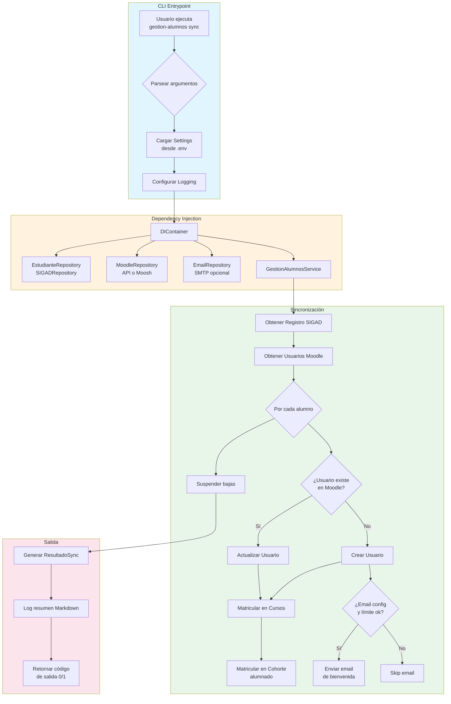
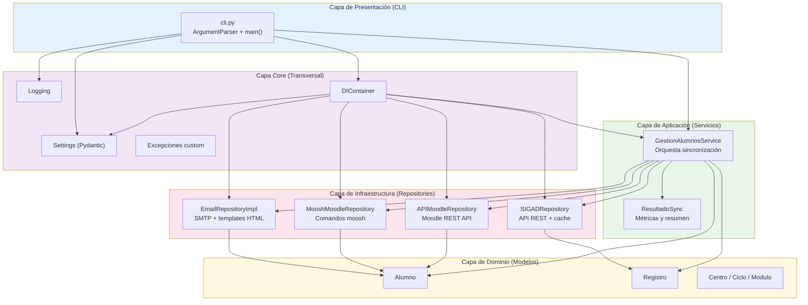
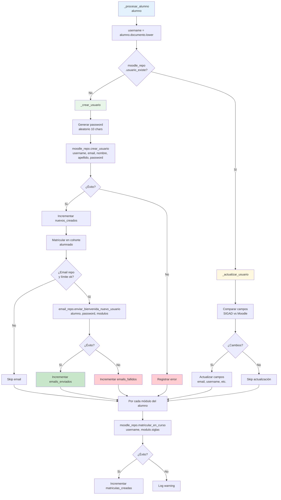
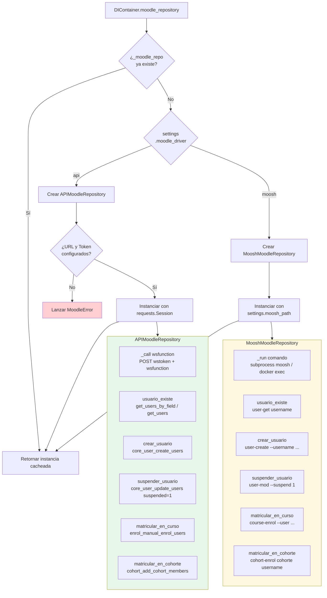
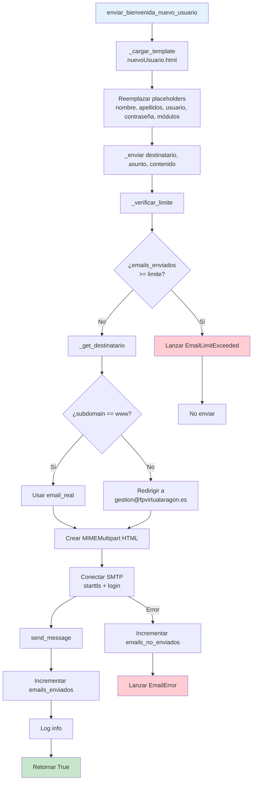
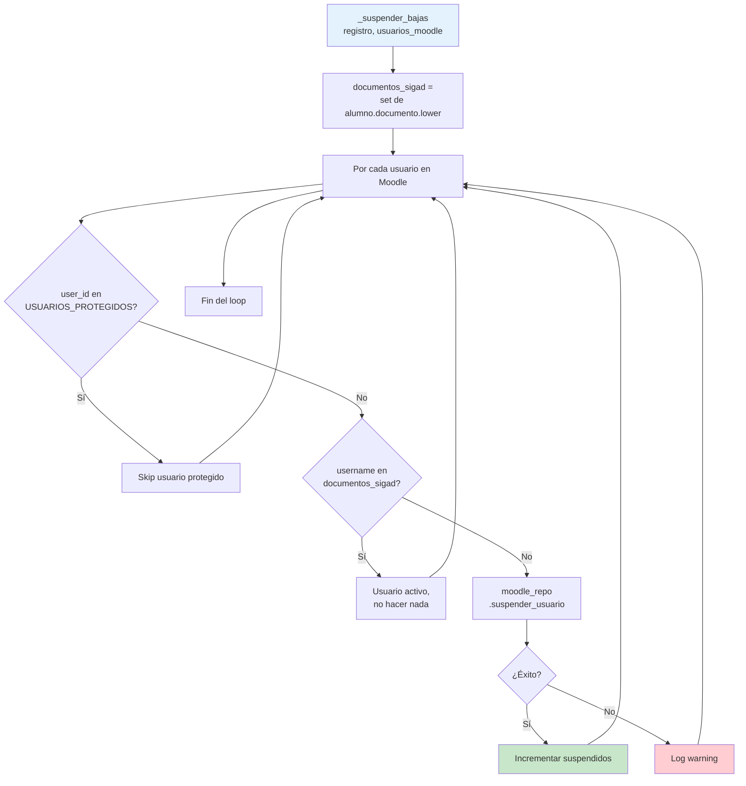
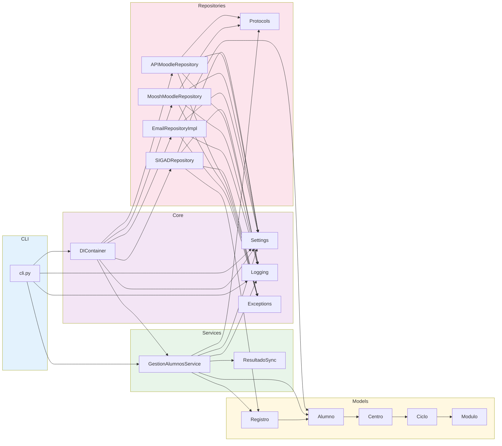

# Flujos de la Aplicación: Gestión de Alumnos

Documento que describe los flujos principales del sistema de gestión automática de alumnos entre SIGAD y Moodle.

---

## Índice de Contenidos

- [1. Flujo General de Sincronización](#1-flujo-general-de-sincronización)
- [2. Arquitectura de Capas](#2-arquitectura-de-capas)
- [3. Flujo de Obtención de Datos SIGAD](#3-flujo-de-obtención-de-datos-sigad)
- [4. Flujo de Procesamiento de un Alumno](#4-flujo-de-procesamiento-de-un-alumno)
- [5. Flujo de Selección del Driver Moodle](#5-flujo-de-selección-del-driver-moodle)
- [6. Flujo de Envío de Emails](#6-flujo-de-envío-de-emails)
- [7. Flujo de Suspensión de Bajas](#7-flujo-de-suspensión-de-bajas)
- [8. Diagrama de Dependencias entre Módulos](#8-diagrama-de-dependencias-entre-módulos)
- [Resumen de Comandos CLI](#resumen-de-comandos-cli)
- [Estados del ResultadoSync](#estados-del-resultadosync)

---

## 1. Flujo General de Sincronización

Flujo completo desde la invocación CLI hasta la generación del informe final.



---

## 2. Arquitectura de Capas

Diagrama de la estructura de capas del sistema y sus dependencias.



---

## 3. Flujo de Obtención de Datos SIGAD

Detalle del proceso de descarga desde la API de SIGAD, incluyendo reintentos y modos de operación.

```mermaid
flowchart TD
    A[obtener_registro] --> B{¿is_test?}
    B -->|Sí| C[Cargar desde<br/>tests/data/test_estudiantes_data.json]
    B -->|No| D[_descargar_desde_api]

    D --> E{¿Credenciales<br/>configuradas?}
    E -->|No| F[Lanzar APIError]
    E -->|Sí| G[_solicitar_datos]

    G --> H[POST /solicitud/{año}]
    H --> I{Respuesta}
    I -->|Timeout| J[Lanzar APITimeoutError]
    I -->|Error HTTP| K[Lanzar APIError]
    I -->|codigo != 0| L[Lanzar APIError]
    I -->|codigo == 0| M[Extraer idSolicitud]

    M --> N[Esperar 3s]
    N --> O[_obtener_estudiantes_con_reintentos]

    O --> P[GET /fichero/{idSolicitud}]
    P --> Q{Intento N/M}
    Q -->|Timeout| R{¿Último intento?}
    R -->|Sí| S[Lanzar APITimeoutError]
    R -->|No| T[Esperar delay] --> P
    Q -->|codigo == 0| U[Parsear JSON] --> V[_guardar_copia_local]
    Q -->|codigo == -1| W{¿Último intento?}
    W -->|Sí| X[Lanzar APIError]
    W -->|No| Y[Esperar delay] --> P
    Q -->|Otro error| Z[Lanzar APIError]

    V --> AA[Guardar en data/estudiantes_{id}.json]
    AA --> AB{¿is_produccion?}
    AB -->|Sí| AC[_limpiar_archivos_antiguos]
    AB -->|No| AD[Retornar Registro]
    AC --> AD

    C --> AD

    style A fill:#e3f2fd
    style AD fill:#c8e6c9
    style F fill:#ffcdd2
    style J fill:#ffcdd2
    style K fill:#ffcdd2
    style L fill:#ffcdd2
    style S fill:#ffcdd2
    style X fill:#ffcdd2
    style Z fill:#ffcdd2
```

---

## 4. Flujo de Procesamiento de un Alumno

Decisiones tomadas para cada alumno durante la sincronización.



---

## 5. Flujo de Selección del Driver Moodle

El sistema soporta dos drivers para Moodle: API REST y Moosh. Este flujo muestra cómo se selecciona e instancia el repositorio adecuado.



---

## 6. Flujo de Envío de Emails

Proceso de notificación a los usuarios recién creados, con control de límites y templates HTML.



---

## 7. Flujo de Suspensión de Bajas

Al finalizar la sincronización, se suspenden los usuarios de Moodle que ya no están en SIGAD.



---

## 8. Diagrama de Dependencias entre Módulos

Vista general de imports y relaciones entre los paquetes Python.



---

## Resumen de Comandos CLI

| Comando | Descripción | Estado |
|---------|-------------|--------|
| `sync` | Sincronización completa SIGAD → Moodle | Implementado |
| `sync --desde-fichero` | Sincronización desde JSON local | Implementado |
| `extract` | Extraer alumnado a CSV | Pendiente |
| `report` | Generar informe sin modificar datos | Pendiente |

---

## Estados del ResultadoSync

| Métrica | Descripción |
|---------|-------------|
| `alumnos_sigad` | Total de alumnos en el registro SIGAD |
| `alumnos_moodle` | Total de usuarios existentes en Moodle |
| `nuevos_creados` | Usuarios nuevos creados en Moodle |
| `suspendidos` | Usuarios suspendidos (bajas) |
| `reactivados` | Usuarios reactivados |
| `emails_actualizados` | Emails modificados |
| `usernames_actualizados` | Usernames modificados |
| `matriculas_creadas` | Matrículas en cursos realizadas |
| `matriculas_suspendidas` | Matrículas suspendidas |
| `emails_enviados` | Emails de bienvenida enviados |
| `emails_fallidos` | Emails que fallaron |
| `errores` | Lista de mensajes de error |
