# Flujos de la Aplicación: Gestión de Alumnos v0.4.1

Documento que describe los flujos principales del sistema de gestión automática de alumnos entre SIGAD y Moodle.

---

## Índice de Contenidos

- [1. Flujo General de Sincronización (v0.4)](#1-flujo-general-de-sincronización-v04)
- [2. Arquitectura de Capas](#2-arquitectura-de-capas)
- [3. Flujo de Obtención de Datos SIGAD](#3-flujo-de-obtención-de-datos-sigad)
- [4. Flujo de Obtención de Datos Moodle](#4-flujo-de-obtención-de-datos-moodle)
- [5. Flujo de Análisis con DuckDB](#5-flujo-de-análisis-con-duckdb)
- [6. Flujo de Aplicación de Cambios](#6-flujo-de-aplicación-de-cambios)
- [7. Flujo de Selección del Driver Moodle](#7-flujo-de-selección-del-driver-moodle)
- [8. Flujo de Envío de Emails](#8-flujo-de-envío-de-emails)
- [9. Diagrama de Dependencias entre Módulos](#9-diagrama-de-dependencias-entre-módulos)
- [Resumen de Comandos CLI](#resumen-de-comandos-cli)
- [Estados del SyncReport](#estados-del-syncreport)

---

## 1. Flujo General de Sincronización (v0.4)

Flujo completo desde la invocación CLI hasta la generación del informe final.

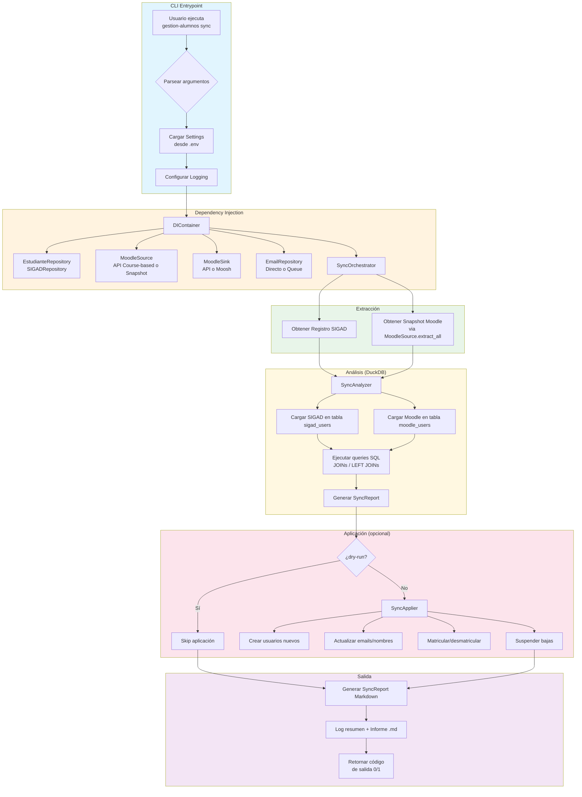

---

## 2. Arquitectura de Capas

Diagrama de la estructura de capas del sistema y sus dependencias.

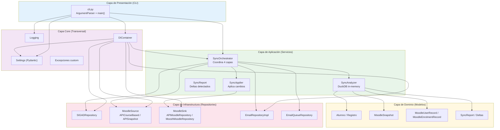

---

## 3. Flujo de Obtención de Datos SIGAD

Detalle del proceso de descarga desde la API de SIGAD, incluyendo reintentos y modos de operación.

```mermaid
flowchart TD
    A[obtener_registro] --> B{¿is_test?}
    B -->|Sí| C[Cargar desde<br/>tests/data/test_estudiantes_data.json]
    B -->|No| D[_descargar_desde_api]

    D --> E{¿Credenciales<br/>configuradas?}
    E -->|No| F[Lanzar APIError]
    E -->|Sí| G[_solicitar_datos]

    G --> H[POST /solicitud/{año}]
    H --> I{Respuesta}
    I -->|Timeout| J[Lanzar APITimeoutError]
    I -->|Error HTTP| K[Lanzar APIError]
    I -->|codigo != 0| L[Lanzar APIError]
    I -->|codigo == 0| M[Extraer idSolicitud]

    M --> N[Esperar 3s]
    N --> O[_obtener_estudiantes_con_reintentos]

    O --> P[GET /fichero/{idSolicitud}]
    P --> Q{Intento N/M}
    Q -->|Timeout| R{¿Último intento?}
    R -->|Sí| S[Lanzar APITimeoutError]
    R -->|No| T[Esperar delay] --> P
    Q -->|codigo == 0| U[Parsear JSON] --> V[_guardar_copia_local]
    Q -->|codigo == -1| W{¿Último intento?}
    W -->|Sí| X[Lanzar APIError]
    W -->|No| Y[Esperar delay] --> P
    Q -->|Otro error| Z[Lanzar APIError]

    V --> AA[Guardar en data/estudiantes_{id}.json]
    AA --> AB{¿is_produccion?}
    AB -->|Sí| AC[_limpiar_archivos_antiguos]
    AB -->|No| AD[Retornar Registro]
    AC --> AD

    C --> AD

    style A fill:#e3f2fd
    style AD fill:#c8e6c9
    style F fill:#ffcdd2
    style J fill:#ffcdd2
    style K fill:#ffcdd2
    style L fill:#ffcdd2
    style S fill:#ffcdd2
    style X fill:#ffcdd2
    style Z fill:#ffcdd2
```

---

## 4. Flujo de Obtención de Datos Moodle

### Opción A: API Course-based (~1000 llamadas)

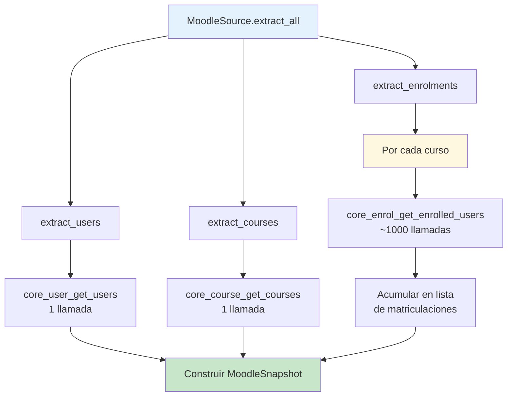

### Opción B: API Snapshot (1 llamada, requiere plugin)

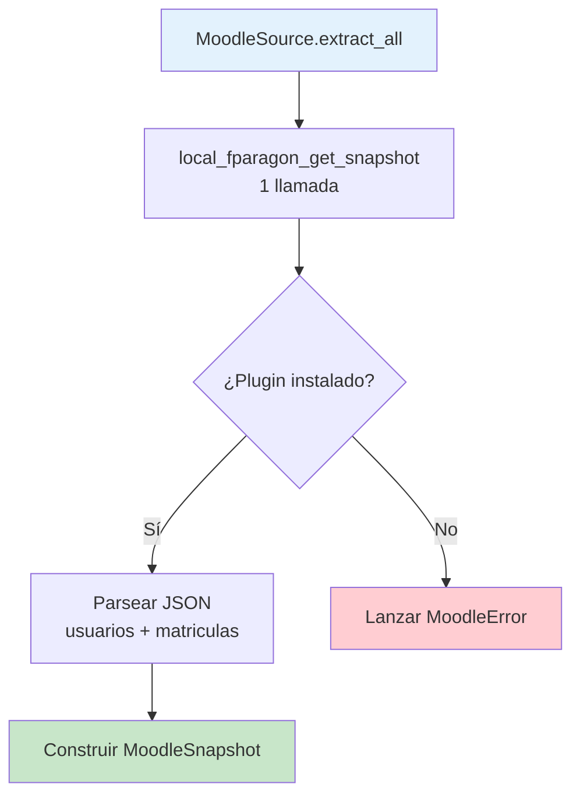

---

## 5. Flujo de Análisis con DuckDB

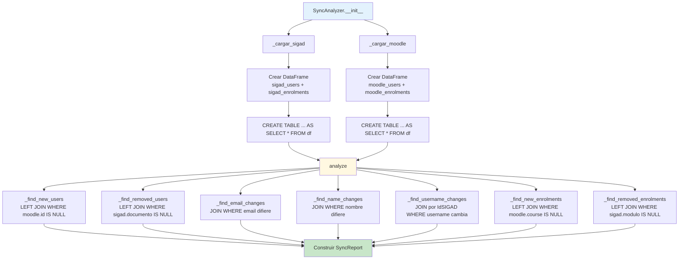

---

## 6. Flujo de Aplicación de Cambios

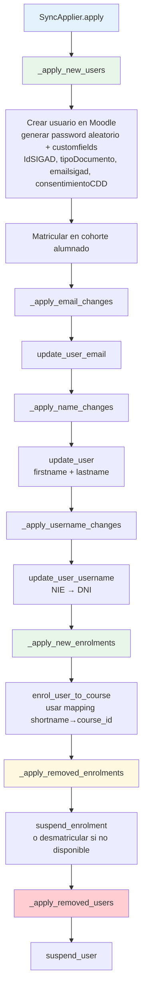

---

## 7. Flujo de Selección del Driver Moodle

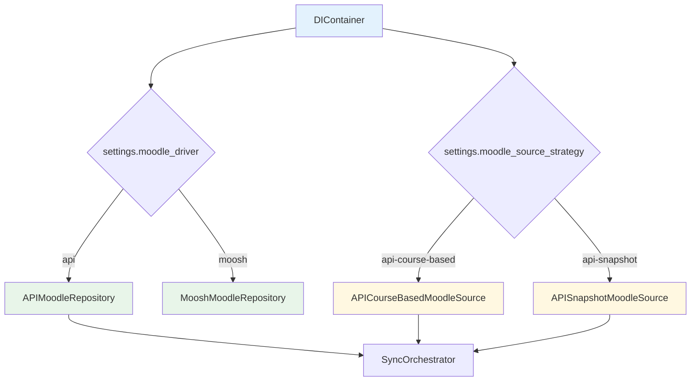

---

## 8. Flujo de Envío de Emails

### Modo Directo (SMTP inmediato)

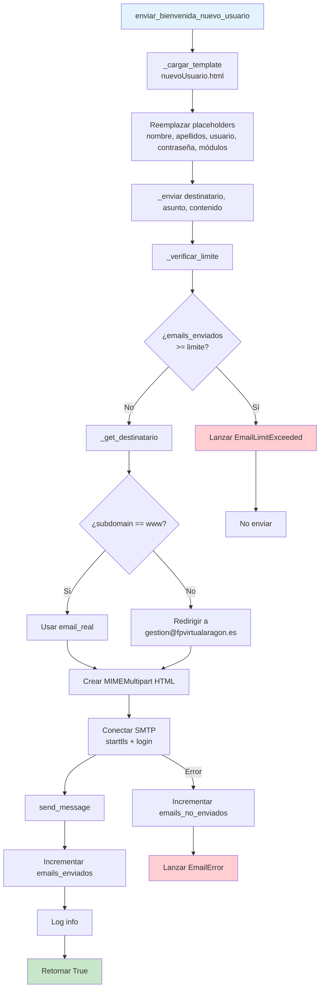

Cuando `EMAIL_MODE=queue`, los emails no se envían por SMTP inmediatamente. En su lugar se escriben en `csvs/email_queue.csv` y se procesan posteriormente con el comando `process-emails`.

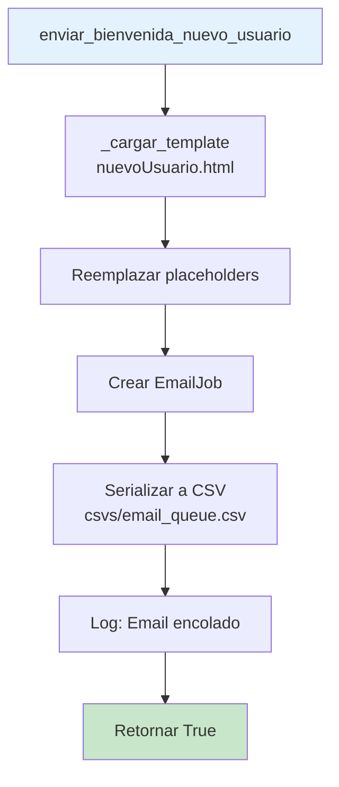

### Modo Cola (CSV para procesamiento externo)


---

### Flujo de Procesamiento de Cola (process-emails)

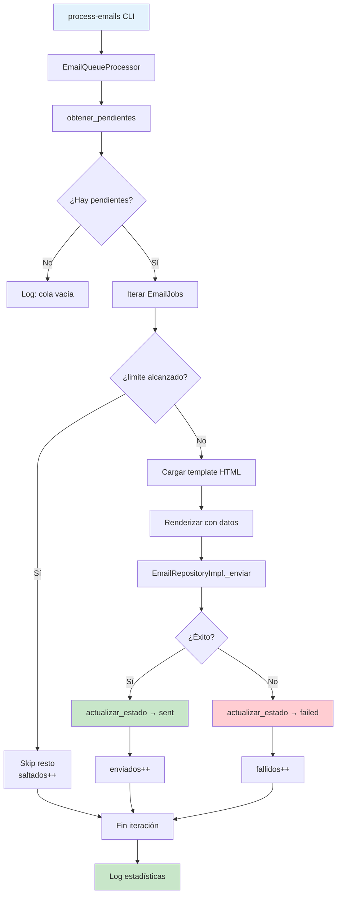

## 9. Diagrama de Dependencias entre Módulos

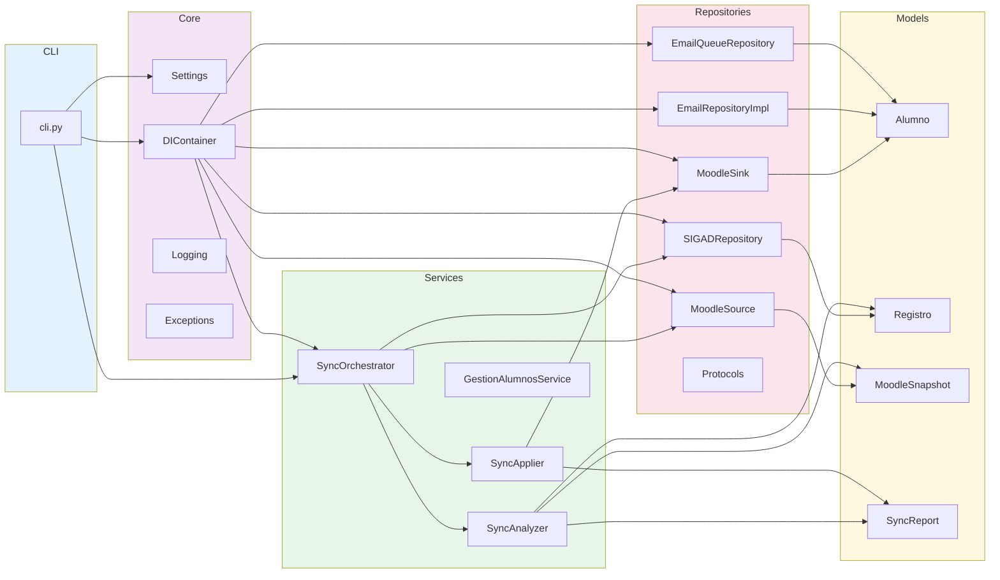

---

## Resumen de Comandos CLI

| Comando | Descripción | Estado |
|---------|-------------|--------|
| `sync` | Analizar diferencias (dry-run por defecto) | ✅ v0.4 |
| `sync --apply` | Aplicar cambios en Moodle | ✅ v0.4 |
| `sync --source-strategy api-snapshot` | Usar plugin PHP para extracción | ✅ v0.4 |
| `report` | Generar informe sin modificar datos | ✅ v0.4 |
| `process-emails` | Enviar emails pendientes de la cola CSV | ✅ v0.4.1 |
| `extract` | Extraer alumnado a CSV | Pendiente |

---

## Estados del SyncReport

| Delta | Descripción |
|-------|-------------|
| `new_users` | Alumnos en SIGAD que no existen en Moodle (altas) |
| `removed_users` | Usuarios en Moodle que no están en SIGAD (bajas) |
| `email_changes` | Emails diferentes entre SIGAD y Moodle |
| `name_changes` | Nombre o apellidos diferentes |
| `username_changes` | Cambio de documento/username (ej: NIE→DNI) |
| `new_enrolments` | Matrículas en SIGAD no presentes en Moodle |
| `removed_enrolments` | Matrículas en Moodle no presentes en SIGAD |
