# Análisis de Deltas en SyncAnalyzer

Este documento explica paso a paso cómo `SyncAnalyzer` detecta las diferencias entre los datos de SIGAD y los datos de Moodle usando **DuckDB in-memory**. Incluye diagramas de flujo, las queries SQL reales y ejemplos concretos.

---

## Índice

1. [Visión General](#visión-general)
2. [Carga de Datos en DuckDB](#carga-de-datos-en-duckdb)
3. [Flujo Completo del Análisis](#flujo-completo-del-análisis)
4. [Delta 1: Altas (New Users)](#delta-1-altas-new-users)
5. [Delta 2: Bajas (Removed Users)](#delta-2-bajas-removed-users)
6. [Delta 3: Cambios de Email](#delta-3-cambios-de-email)
7. [Delta 4: Cambios de Nombre/Apellidos](#delta-4-cambios-de-nombreapellidos)
8. [Delta 5: Cambios de Username (NIE → DNI)](#delta-5-cambios-de-username-nie--dni)
9. [Delta 6: Nuevas Matrículas](#delta-6-nuevas-matrículas)
10. [Delta 7: Matrículas Eliminadas](#delta-7-matrículas-eliminadas)
11. [Casos Especiales](#casos-especiales)
12. [Resumen de Tipos de Delta](#resumen-de-tipos-de-delta)

---

## Visión General

`SyncAnalyzer` es un servicio puro (sin dependencias de red) que recibe:

- **`Registro`** de SIGAD: lista jerárquica de alumnos → centros → ciclos → módulos
- **`MoodleSnapshot`**: lista plana de usuarios, cursos y matriculaciones de Moodle

Su objetivo es producir un **`SyncReport`** con todos los **deltas** (diferencias) detectados.

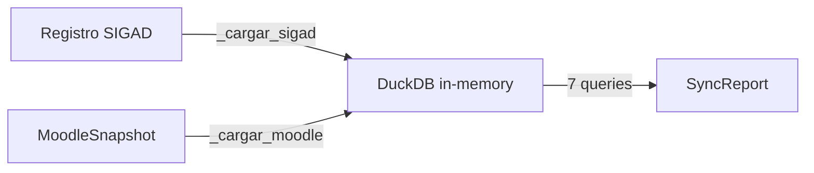

---

## Carga de Datos en DuckDB

Antes de analizar, el analyzer normaliza ambas fuentes en **4 tablas planas**:

### Tablas SIGAD

| Tabla | Origen | Filas |
|-------|--------|-------|
| `sigad_users` | Un `Alumno` → una fila | `documento`, `nombre`, `apellido1`, `apellido2`, `email` |
| `sigad_enrolments` | Un `Alumno` × sus módulos → N filas | `documento`, `codigo_centro`, `siglas_ciclo`, `siglas_modulo` |

### Tablas Moodle

| Tabla | Origen | Filas |
|-------|--------|-------|
| `moodle_users` | Un `MoodleUserRecord` → una fila | `id`, `username`, `email`, `firstname`, `lastname`, `suspended` |
| `moodle_enrolments` | Un `MoodleEnrolmentRecord` → una fila | `user_id`, `username`, `course_id`, `shortname`, `status` |

> **Nota sobre normalización:** El `documento` de SIGAD se convierte a `UPPERCASE`. El `username` de Moodle se convierte a `lowercase`. Esto permite comparar `78842153Q` (SIGAD) con `78842153q` (Moodle).

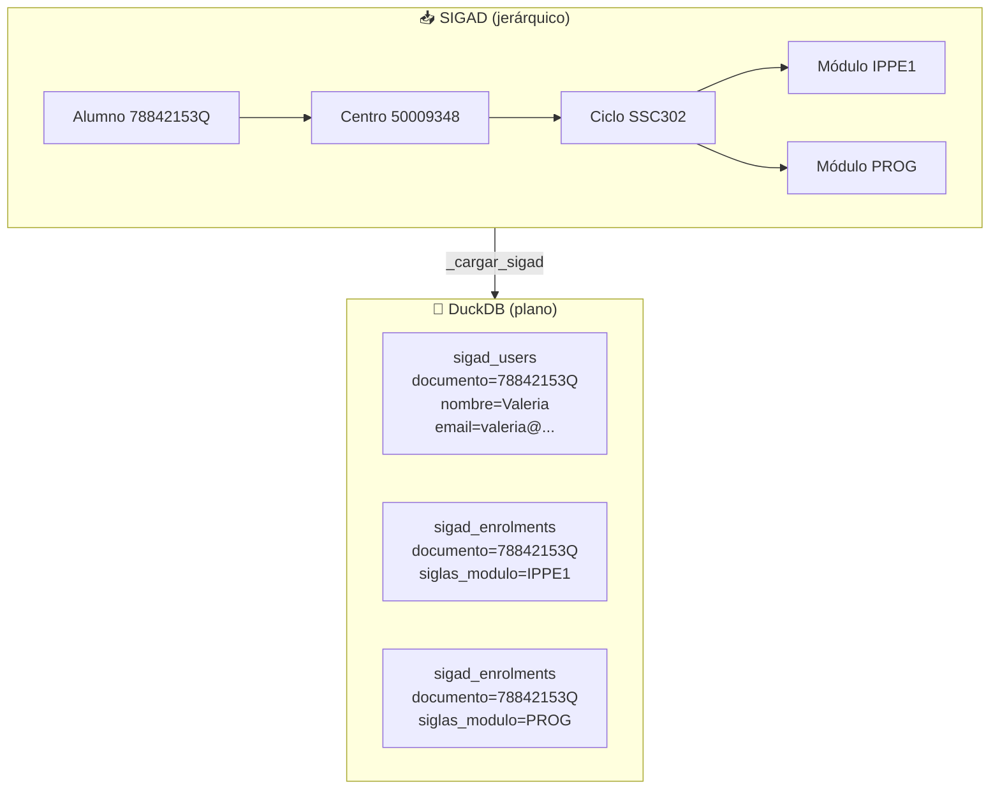

---

## Flujo Completo del Análisis

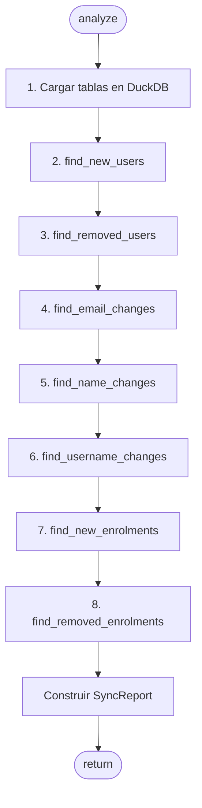

> **Importante:** Los 7 análisis son **independientes** entre sí. Se ejecutan secuencialmente pero cada uno opera sobre las mismas 4 tablas cargadas inicialmente.

---

## Delta 1: Altas (New Users)

**Definición:** Alumnos que existen en SIGAD pero no tienen usuario en Moodle.

### Lógica

```sql
SELECT s.documento
FROM sigad_users s
LEFT JOIN moodle_users m ON m.username = lower(s.documento)
WHERE m.id IS NULL
```

### Diagrama

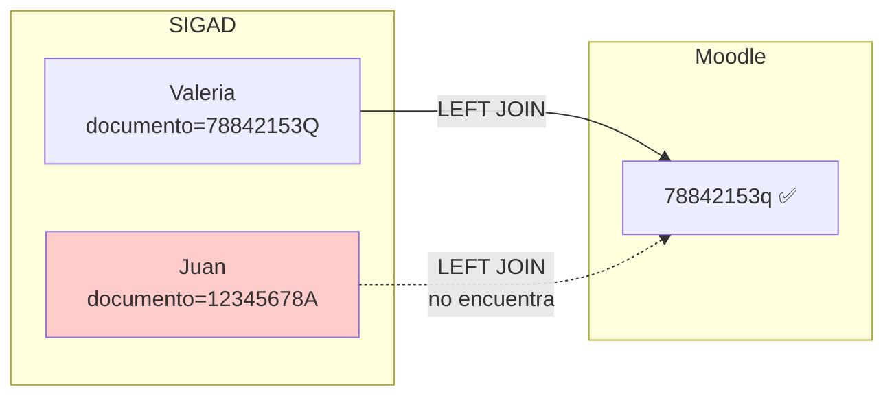

### Ejemplo

| Origen | Documento | ¿En Moodle? | Resultado |
|--------|-----------|-------------|-----------|
| SIGAD | `78842153Q` | Sí (`78842153q`) | — |
| SIGAD | `12345678A` | **No** | ✅ **Alta detectada** |

**Salida:** `NewUserDelta(alumno=Juan)`

---

## Delta 2: Bajas (Removed Users)

**Definición:** Usuarios que existen en Moodle pero no están en SIGAD. Se excluyen los usuarios **protegidos** (admin, guest, etc. cargados desde CSV).

### Lógica

```sql
SELECT m.id, m.username, m.email, m.firstname, m.lastname, m.suspended
FROM moodle_users m
LEFT JOIN sigad_users s ON lower(s.documento) = m.username
WHERE s.documento IS NULL
  AND m.id NOT IN (1, 2, 3, ...)  -- usuarios protegidos
```

### Diagrama

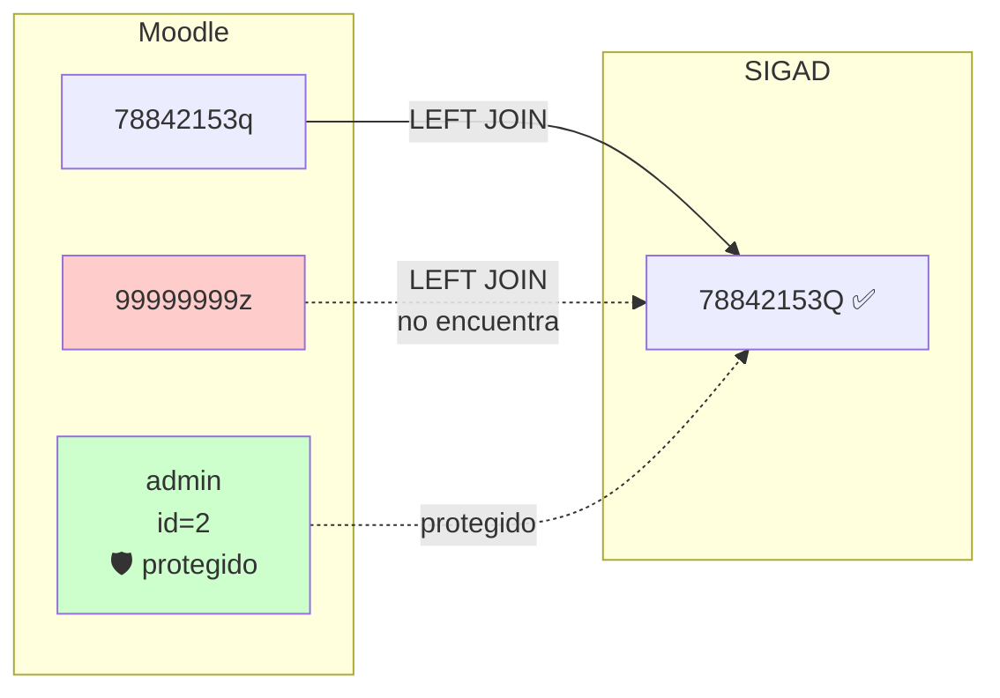

### Ejemplo

| Origen | Username | ¿En SIGAD? | ¿Protegido? | Resultado |
|--------|----------|------------|-------------|-----------|
| Moodle | `78842153q` | Sí | — | — |
| Moodle | `99999999z` | **No** | No | ✅ **Baja detectada** |
| Moodle | `admin` | No | **Sí (id=2)** | — |

**Salida:** `RemovedUserDelta(user=MoodleUserRecord(id=102, username="99999999z", ...))`

---

## Delta 3: Cambios de Email

**Definición:** Alumnos que existen en ambos sistemas pero tienen direcciones de email diferentes (o uno es nulo y el otro no).

### Lógica

```sql
SELECT
    s.documento,
    s.email AS email_sigad,
    m.email AS email_moodle
FROM sigad_users s
JOIN moodle_users m ON lower(s.documento) = m.username
WHERE lower(s.email) <> lower(m.email)
   OR (s.email IS NOT NULL AND m.email IS NULL)
   OR (s.email IS NULL AND m.email IS NOT NULL)
```

### Diagrama

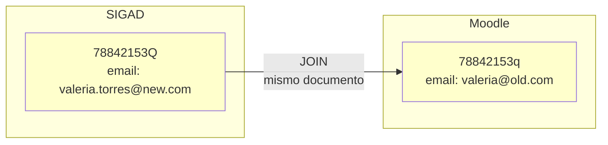

### Ejemplo

| Documento | Email SIGAD | Email Moodle | ¿Diferente? |
|-----------|-------------|--------------|-------------|
| `78842153Q` | `valeria.torres@new.com` | `valeria@old.com` | ✅ **Sí** |
| `12345678A` | `juan@ejemplo.com` | `juan@ejemplo.com` | No |

**Salida:** `EmailChangeDelta(documento="78842153Q", email_sigad="valeria.torres@new.com", email_moodle="valeria@old.com")`

---

## Delta 4: Cambios de Nombre/Apellidos

**Definición:** Alumnos cuyo nombre o apellidos difieren entre SIGAD y Moodle. El desafío aquí es que SIGAD tiene `nombre` + `apellido1` + `apellido2` (3 campos) mientras Moodle tiene `firstname` + `lastname` (2 campos).

### Lógica

```sql
SELECT
    s.documento, s.nombre, s.apellido1, s.apellido2,
    m.firstname, m.lastname
FROM sigad_users s
JOIN moodle_users m ON lower(s.documento) = m.username
WHERE s.nombre <> m.firstname
   OR s.apellido1 <> split_part(m.lastname, ' ', 1)
   OR COALESCE(s.apellido2, '') <> trim(
          replace(m.lastname, split_part(m.lastname, ' ', 1), '')
      )
```

### Diagrama

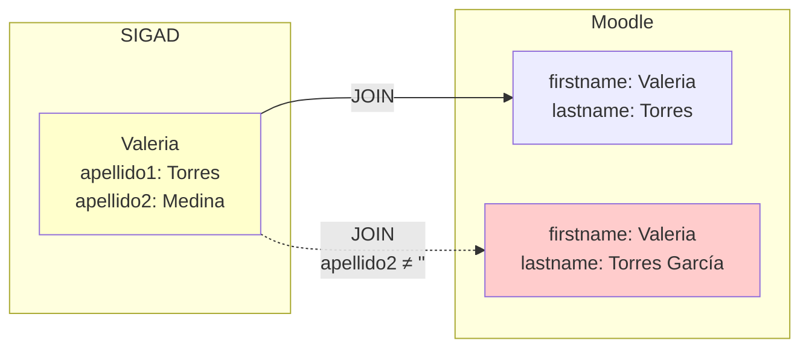

### Ejemplo

| Documento | SIGAD | Moodle | ¿Diferente? |
|-----------|-------|--------|-------------|
| `78842153Q` | `Valeria` / `Torres` / `Medina` | `Valeria` / `Torres Medina` | No (match aproximado) |
| `99999999Z` | `Ana` / `García` / `López` | `Ana` / `García` | ✅ **Sí** (falta López) |

> **Heurística:** `split_part(lastname, ' ', 1)` extrae el primer apellido. `replace(lastname, primer_apellido, '')` extrae el resto (segundo apellido). Esto es una aproximación.

**Salida:** `NameChangeDelta(documento="99999999Z", nombre_sigad="Ana", apellido1_sigad="García", apellido2_sigad="López", firstname_moodle="Ana", lastname_moodle="García")`

---

## Delta 5: Cambios de Username (NIE → DNI)

**Definición:** Un alumno cambió su documento de identidad (ej: de NIE extranjero a DNI español) pero mantiene el mismo email. Se detecta cruzando por email.

### Lógica

```sql
SELECT
    m.username AS old_username,
    s.documento AS new_documento,
    s.email AS email
FROM moodle_users m
JOIN sigad_users s ON lower(s.email) = lower(m.email)
WHERE m.username <> lower(s.documento)
```

### Diagrama

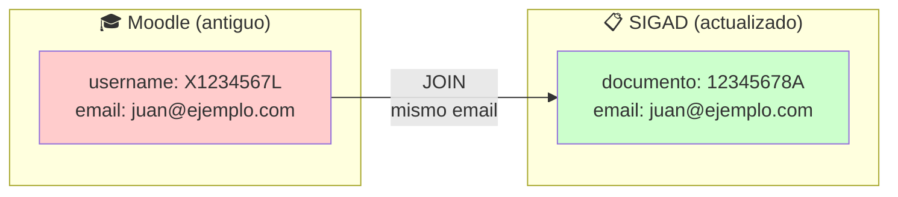

### Ejemplo

| Origen | Identificador | Email | Coincidencia |
|--------|---------------|-------|--------------|
| Moodle | `X1234567L` | `juan@ejemplo.com` | — |
| SIGAD | `12345678A` | `juan@ejemplo.com` | ✅ Mismo email |

**Salida:** `UsernameChangeDelta(old_username="X1234567L", new_documento="12345678A", email="juan@ejemplo.com")`

> **Caso de uso típico:** Un estudiante extranjero obtiene la nacionalidad y cambia su NIE por DNI. SIGAD refleja el nuevo documento, pero Moodle conserva el antiguo como `username`.

---

## Delta 6: Nuevas Matrículas

**Definición:** Módulos/cursos en los que un alumno debería estar matriculado según SIGAD pero no lo está en Moodle.

### Lógica

```sql
SELECT
    s.documento,
    s.siglas_modulo AS shortname
FROM sigad_enrolments s
LEFT JOIN moodle_enrolments me
    ON me.username = lower(s.documento)
   AND me.shortname = s.siglas_modulo
WHERE me.course_id IS NULL
```

### Diagrama

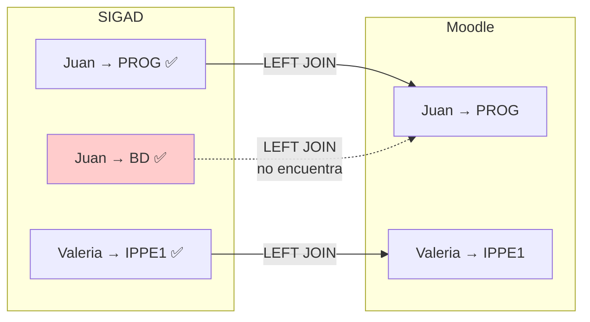

### Ejemplo

| Alumno | Módulo SIGAD | ¿En Moodle? | Resultado |
|--------|--------------|-------------|-----------|
| Juan (`12345678A`) | `PROG` | Sí | — |
| Juan (`12345678A`) | `BD` | **No** | ✅ **Nueva matrícula** |
| Valeria (`78842153Q`) | `IPPE1` | Sí | — |

**Salida:** `EnrolmentDelta(documento="12345678A", course_shortname="BD")`

---

## Delta 7: Matrículas Eliminadas

**Definición:** Matrículas en Moodle que no deberían existir según SIGAD. Ocurre cuando un alumno abandona un módulo o se transfiere.

### Lógica

```sql
SELECT
    me.username AS documento,
    me.shortname,
    me.course_id
FROM moodle_enrolments me
LEFT JOIN sigad_enrolments se
    ON lower(se.documento) = me.username
   AND se.siglas_modulo = me.shortname
WHERE se.documento IS NULL
```

### Diagrama

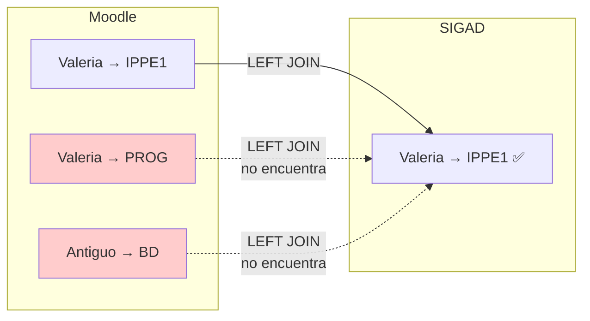

### Ejemplo

| Alumno (Moodle) | Módulo Moodle | ¿En SIGAD? | Resultado |
|-----------------|---------------|------------|-----------|
| `78842153q` | `IPPE1` | Sí (Valeria) | — |
| `78842153q` | `PROG` | **No** | ✅ **Matrícula a eliminar** |
| `99999999z` | `BD` | **No** (baja total) | ✅ **Matrícula a eliminar** |

> **Nota:** Una matrícula eliminada puede preceder una baja total (Delta 2). Si el usuario ya no está en SIGAD, todas sus matrículas aparecerán como eliminadas.

**Salida:** `EnrolmentDelta(documento="78842153q", course_shortname="PROG", course_id=2)`

---

## Casos Especiales

### Usuarios Protegidos

El sistema carga un CSV (`data/usuarios_protegidos.csv`) con IDs de Moodle que nunca deben eliminarse ni suspenderse (admin, guest, cuentas de servicio, etc.).

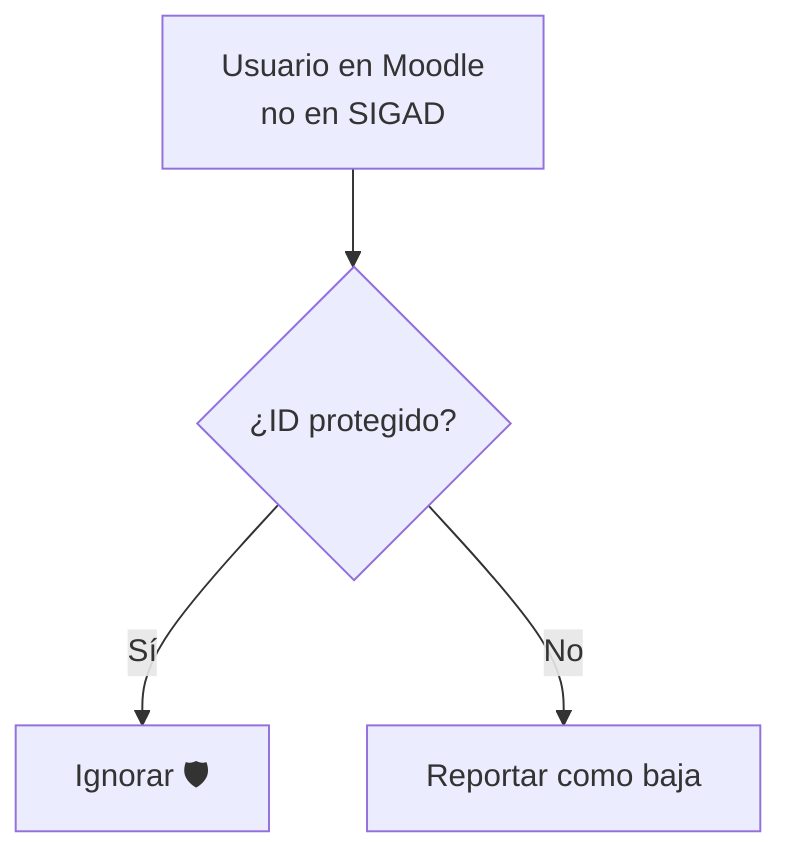

### NIE → DNI

Este delta depende críticamente de que el alumno mantenga el **mismo email** entre el cambio de documento. Si el email también cambia, el sistema no detectará automáticamente la relación y reportará:
- Una **baja** del usuario antiguo (NIE)
- Una **alta** del usuario nuevo (DNI)

Esto es el comportamiento esperado y seguro.

---

## Resumen de Tipos de Delta

| # | Delta | JOIN | WHERE | Origen de la clave |
|---|-------|------|-------|-------------------|
| 1 | **Altas** | `sigad LEFT JOIN moodle` | `moodle.id IS NULL` | Documento normalizado |
| 2 | **Bajas** | `moodle LEFT JOIN sigad` | `sigad.documento IS NULL` + no protegido | Documento normalizado |
| 3 | **Email** | `sigad INNER JOIN moodle` | `email` diferente (case-insensitive) | Documento normalizado |
| 4 | **Nombre** | `sigad INNER JOIN moodle` | `nombre` o `apellidos` diferente | Documento normalizado |
| 5 | **Username** | `moodle INNER JOIN sigad` | `username <> documento` cruzado por **email** | Email normalizado |
| 6 | **Matrículas nuevas** | `sigad_enrol LEFT JOIN moodle_enrol` | `moodle.course_id IS NULL` | Documento + siglas módulo |
| 7 | **Matrículas eliminadas** | `moodle_enrol LEFT JOIN sigad_enrol` | `sigad.documento IS NULL` | Documento + siglas módulo |

### Matriz de decisión

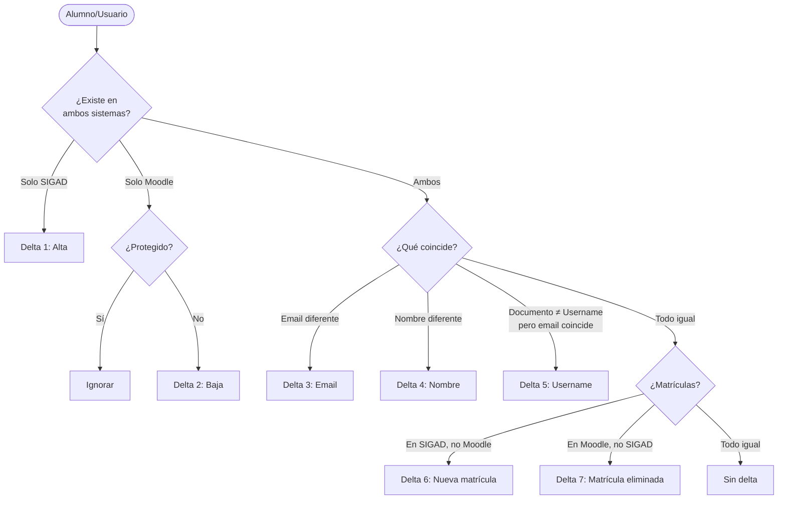

---

## Referencias

- Código fuente: [`gestion_alumnos/services/sync_analyzer.py`](../gestion_alumnos/services/sync_analyzer.py)
- Modelos de delta: [`gestion_alumnos/models/sync_report.py`](../gestion_alumnos/models/sync_report.py)
- Tests unitarios: [`tests/test_sync_analyzer.py`](../tests/test_sync_analyzer.py)
